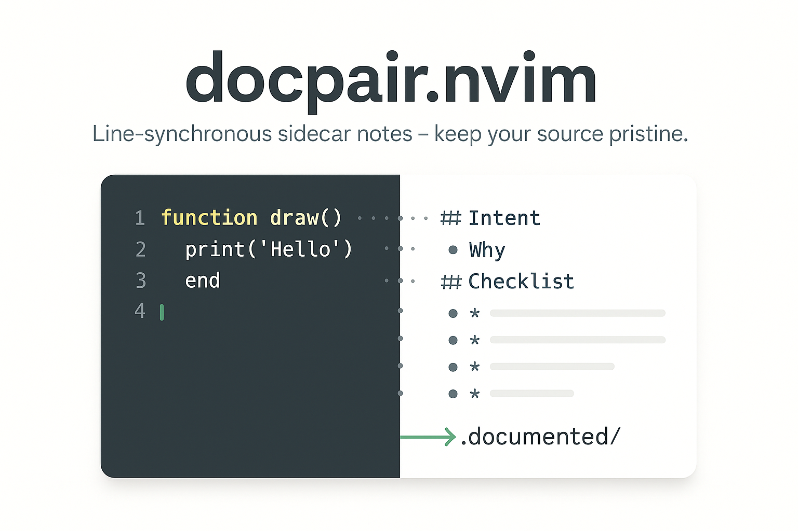

# docpair.nvim

Keep your source **pristine**. Put your thoughts, checklists, and long‑form explanations in a **sidecar** file that stays line‑synchronous with the code.

`docpair.nvim` opens your source on the left and a matching notes file on the right. Each line *N* in the source corresponds to line *N* in your notes — simple, predictable, and perfect for learning APIs, reviewing code, teaching, or documenting thought processes **without** cluttering the source.





---

## Why this exists

Code comments are great for documenting *what* an API does and *why* a decision was made. They are less great for:

- exploratory notes and “thinking out loud”
- step‑by‑step tutorials and learning trails
- temporary to‑dos, questions, or review remarks
- long checklists and experiment logs

Those belong next to the code — not **inside** it. `docpair.nvim` gives you that adjacent space, kept in lockstep with your source, while your repository stays clean and your diffs focused on code.

---

## Features

- **Line‑synchronous pairing**
  Scroll or move in one window; the other stays aligned by line number.

- **Sidecar storage**
  Notes live in a hidden folder next to your file:
  `<dir-of-source>/.documented/`

- **Zero ceremony**
  No new formats, no ASTs, no magic. It’s just files and window options.

- **Minimal configuration**
  Choose the notes buffer’s filetype (default: `markdown`) and go.

---

## Installation (lazy.nvim)

```lua
-- in: ~/.config/nvim/lua/plugins/docpair.lua
return {
  "isticusi/docpair.nvim",
  main = "docpair",
  lazy = false,                -- eager so :Documented has filename completion immediately
  opts = { info_filetype = "markdown" },
  config = true,               -- calls require("docpair").setup(opts)
}
```

> Not using lazy.nvim? The plugin ships with `plugin/docpair.lua` which auto‑calls `require("docpair").setup({})` for you.

---

## Usage

### Command

```
:Documented [file] [infofile][!]
```

- Opens `[file]` on the **left** and its notes on the **right**.
- Notes are always written under `<dir-of-[file]>/.documented/`, or when the folder is not accessable because of write restrictions to `~/.config/docpair/tree/`
- If `[infofile]` is omitted, the default name is `<basename([file])>_info`.
- If `[infofile]` is provided, only its **basename** is used; it still goes into `.documented/`.
- `!` keeps the current tab (closes other windows) before vsplitting; without `!`, a new tab is used.
- `[file]` supports **filename completion**.

### Examples

```vim
:Documented src/main.c
:Documented src/main.c main_notes.md
:Documented! README.md
```

---

## What files get created?

- The first time you pair a file, a hidden folder is created next to it:
  ```
  <dir-of-source>/.documented/
  ```
- A notes file is created inside that folder:
  - `./.documented/<basename(source)>_info` (default), or
  - `./.documented/<basename(infofile)>` (when you pass a second argument)
- The notes file is **padded with empty lines** to match the source’s line count, ensuring line‑to‑line correspondence.

Version‑control them as you like; they’re regular text files.

---

## Configuration

```lua
require("docpair").setup({
  -- Filetype to use for the right‑hand notes buffer
  info_filetype = "markdown",
})
```

---

## Behavior & Defaults

- Both windows start at the **top** (`normal! gg`) with wrapping, soft line breaks, folds, and concealment **disabled** in the notes window to keep alignment stable.
- Synchronization uses Neovim’s native `scrollbind` and `cursorbind`.
- If the source grows **after** you ran `:Documented`, simply run the command again to pad the notes file to the new length.

---

## Philosophy

- **Stay out of the way.** The plugin leverages built‑in window mechanics. No bespoke formats, no complex state, no DSL.
- **Keep sources clean.** Thought processes, explanations, and “learning diaries” live in a sidecar file. Your code and public API comments remain focused.
- **Learn by doing.** Mapping notes 1:1 to lines encourages incremental API exploration without ever losing context.
- **Own your files.** Everything is plain text on disk. Nothing is trapped in a database or custom index.

You shouldn’t need weeks to learn yet another Neovim ecosystem. This is minimal by design — and still solves a very real problem elegantly.

---

## Help

After installation:

```
:help docpair
```

If Neovim doesn’t find the page yet, generate helptags once:

```
:helptags {path-to-docpair.nvim}/doc
```

---

## Limitations

- Line‑synchronous only (by design). There’s no structural/semantic mapping.
- Notes are padded at command time. Re‑run `:Documented` to extend padding after the source grows.

---

## License

MIT
